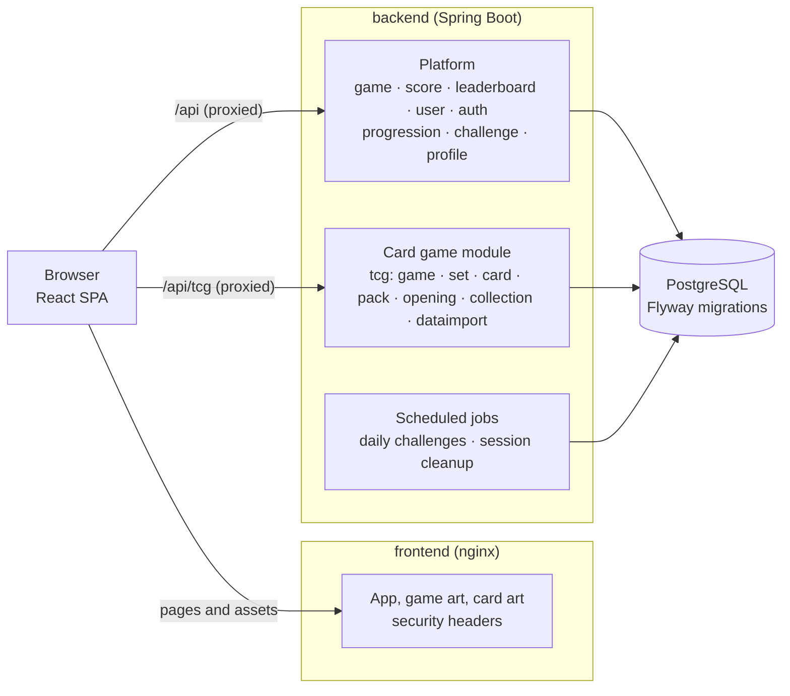

# Cyan Arcade

**Cyan Arcade is a modular full-stack game platform built with React and Spring Boot.** It is a cute, colorful browser arcade: Snake, 2048 and Tetris with AI players, leaderboards, accounts with XP and achievements, daily challenges, and a trading-card game with server-side pack opening.

It is a portfolio project. The goal is a polished, extensible platform where **adding a game means adding a module**: the platform is not rewritten and existing games are not touched.


| | |
| --- | --- |
|  |  |
| Every game has an AI mode that plays by itself | Card packs are opened on the server and revealed one card at a time |
|  |  |
| Every pack publishes its exact odds | The collection, set by set |
|  |  |
| Leaderboards with names, avatars and your own rank | Level, statistics, history and achievements |
|  | |
| The catalog, filterable by category, and the way into card packs | |

<p>
  
  
</p>

## Status

Everything listed below works end to end, in Docker, with 207 backend and 464 frontend tests passing. Nothing is a mock-up. See the [roadmap](#roadmap) for what is next and what is deliberately left out.

## Features

**Games**
- **Snake, 2048 and Tetris**, playable with keyboard and touch.
- **An AI mode for each**, written as classic algorithms that run in the browser (no AI service): a Hamiltonian-cycle Snake that fills the board, an expectimax 2048 player, and a Tetris player that searches every placement with one piece of lookahead. Speed control (0.25x to 8x), pause and restart.
- Pure, deterministic game engines shared by the human player, the AI and the tests.

**Platform**
- **Server-validated scores**: every human run is a server-side game session, and its score is checked and stored in PostgreSQL.
- **Leaderboards** per game with paging, your own best and rank, and names and avatars for players with an account.
- **Accounts**: register, log in, log out. Passwords are stored only as bcrypt hashes; the session lives in an `HttpOnly` cookie with CSRF protection; repeated failed logins are throttled.
- **Progression**: XP for every finished game, levels, and nine achievements.
- **Daily challenges**: a new challenge per game every day, created by a scheduled job and worth bonus XP.
- **Profile**: level and XP progress, statistics, game history, achievements and an avatar.
- **Game hub**: the home page gathers today's challenges, recently played games, featured games, the top scores of each game and categories.
- Guests can play everything; an account is only needed to earn things.

**Card packs (TCG)**
- A trading-card module of its own, built to carry **any number of card games**, each with its own rarities, sets and packs. It ships with *Cyan Critters*: 36 original cards in 2 sets, with 4 packs.
- **Packs are opened on the server**: it draws each card from the pack's pool by the pack's published odds, records the opening and adds the cards to the collection in one transaction. The client only says which pack.
- A pack-opening experience: the pack tears open, cards are dealt face down and flipped one by one, rarer cards glow and burst, then a summary of new cards and duplicates.
- **Collection** with completion per set, and an **opening history**.
- A daily pack allowance (10 by default), and a clean **dataset import** for bringing in other card games.

**Engineering**
- A modular monolith whose boundaries are enforced by tests (ArchUnit in the backend, source-level rules in the frontend).
- One error format for the whole API (RFC 9457 problem details), including 401/403 from the security layer.
- Accessible, responsive UI: phones, tablets and desktop; keyboard support; reduced-motion support; text colors checked against WCAG AA.
- Docker Compose stack with nginx serving the app with security headers and proxying the API.

## Architecture



- **Frontend**: a React SPA. Each game is a module behind one small interface (`GameModule`), with its rules in a pure engine that knows nothing of React. The card game is a separate module mounted under `/tcg` and loaded on demand.
- **Backend**: one deployable Spring Boot application, packaged by feature. Features talk to each other through services and DTOs, never through each other's entities, and the card game module is invisible to the rest of the platform.
- **Data**: PostgreSQL, with the schema owned by Flyway migrations and Hibernate set to `validate`.

The full design, including **how to add a new game**, is in [ARCHITECTURE.md](ARCHITECTURE.md). The API is documented in [API.md](API.md).

## Tech stack

| Layer    | Tech |
| -------- | ---- |
| Frontend | React 19, TypeScript, Vite, React Router, TanStack Query, Tailwind CSS 4, Lucide icons |
| Backend  | Java 21, Spring Boot 4 (Web MVC, Security, Data JPA, Validation, Actuator), Hibernate, Flyway |
| Database | PostgreSQL 18 |
| Testing  | Vitest + Testing Library, JUnit 5, MockMvc, Testcontainers, ArchUnit; coverage with V8 and JaCoCo |
| Tooling  | Docker Compose, nginx, Maven Wrapper, oxlint |

## Getting started

### Prerequisites

- **Docker** (Docker Desktop on Windows and macOS). Needed for the stack and for the backend's integration tests.
- For native development: **Java 21** and **Node.js 22+**. Maven is not needed; the repository ships the Maven Wrapper.

### Run everything in Docker

```bash
docker compose up --build
```

Open http://localhost:3000. The first start creates the database, runs the migrations, imports the bundled card game and creates today's daily challenges.

`docker-compose.yml` runs three services:

| Service | What it is | Reachable at |
| ------- | ---------- | ------------ |
| `frontend` | nginx serving the built app and proxying `/api` to the backend | http://localhost:3000 |
| `backend` | the Spring Boot API | http://127.0.0.1:8080 (this machine only, for tools) |
| `postgres` | PostgreSQL 18, data in the `db-data` volume | 127.0.0.1:5433 (this machine only) |

### Demo data

A fresh database has the games and the card catalog but no players. To fill it the way the screenshots show:

```bash
node tools/demo/seed-demo-data.mjs
```

It plays through the public API: five demo players, games on every leaderboard, and some opened card packs. It takes about two minutes, because the server measures how long each game lasted. The demo accounts' password is in the script; it is for local demos only. `node tools/demo/capture-screenshots.mjs` then retakes the screenshots with a headless Chrome.

### Native development (hot reload)

```bash
docker compose up -d postgres                  # PostgreSQL on localhost:5433
cd backend && ./mvnw spring-boot:run           # API on http://localhost:8080 (Windows: mvnw.cmd)
cd frontend && npm install && npm run dev      # app on http://localhost:5173
```

Vite proxies `/api` and `/actuator` to the backend, so the browser talks to one origin, as it does through nginx in Docker.

> `backend/src/test/java/com/cyan/arcade/TestCyanArcadeApplication.java` starts the backend against a throwaway Testcontainers database, without Compose.

### Database

- The schema is created and upgraded by **Flyway** when the backend starts (`backend/src/main/resources/db/migration`, `V1` to `V10`). There is no manual step.
- The game catalog comes from migrations; the card catalog is imported from dataset files at startup (see [Card games](#card-games)).
- To start over with an empty database: `docker compose down -v`, then `docker compose up -d`.
- Login sessions are kept in the backend's memory, so restarting the backend signs everyone out. Everything else is in PostgreSQL.

### Configuration

Compose reads these from a `.env` file next to `docker-compose.yml`; [.env.example](.env.example) lists them with their defaults.

| Variable | Default | Meaning |
| -------- | ------- | ------- |
| `DB_NAME`, `DB_USERNAME`, `DB_PASSWORD` | `cyan_arcade`, `cyan`, `cyan` | The database and its credentials |
| `DB_PORT` | `5433` | Host port of PostgreSQL (5433 so it can run next to a local PostgreSQL) |
| `BACKEND_PORT` | `8080` | Host port of the API, bound to 127.0.0.1 |
| `FRONTEND_PORT` | `3000` | Host port of the app |
| `SESSION_COOKIE_SECURE` | `false` | Set to `true` wherever the site is served over HTTPS |
| `CORS_ALLOWED_ORIGINS` | `http://localhost:5173` | Origins allowed to call the API directly from a browser, comma-separated |
| `TCG_DAILY_PACK_LIMIT` | `10` | Card packs a player may open per day (UTC); `0` means no limit |

The backend reads further settings from environment variables when run natively (or when added to the `backend` service in Compose):

| Variable | Default | Meaning |
| -------- | ------- | ------- |
| `DB_URL` | `jdbc:postgresql://localhost:5433/cyan_arcade` | JDBC URL of the database |
| `SERVER_PORT` | `8080` | Port the API listens on |
| `LOGIN_MAX_FAILURES`, `LOGIN_FAILURE_WINDOW` | `5`, `5m` | Failed logins allowed per username and address, and how long they are remembered |
| `GAME_SESSIONS_ABANDONED_AFTER` | `24h` | How long a started game may stay unfinished before the hourly cleanup removes it |
| `SCHEDULING_ENABLED` | `true` | Switches every scheduled job on or off |
| `DAILY_CHALLENGES_GENERATION_ENABLED` | `true` | Creates each day's challenges at startup and at midnight UTC |
| `TCG_IMPORT_BUNDLED` | `true` | Imports the card games that ship with the application at startup |
| `TCG_IMPORT_FILES` | empty | Comma-separated paths of further card game datasets to import at startup |

Frontend build and dev settings:

| Variable | Default | Used by |
| -------- | ------- | ------- |
| `API_PROXY_TARGET` | `http://localhost:8080` | The Vite dev server's proxy |
| `VITE_API_BASE_URL` | empty (same origin) | Browser code, to call the backend directly instead of through a proxy |

## Card games

Card games live in the database and are brought in by **importing a dataset**, a JSON file in one documented format (`TcgDataset`, see [ARCHITECTURE.md](ARCHITECTURE.md#importing-card-games)). The application never fetches card data from elsewhere while it runs.

- The bundled game, *Cyan Critters*, is `backend/src/main/resources/tcg/datasets/cyan-critters.json`. It and all of its card, pack and set art are generated by `node tools/tcg/build-cyan-critters.mjs`.
- Every start imports the bundled datasets again. Importing is an upsert on each thing's own code, so it changes nothing unless a dataset changed.
- To add another game, write an adapter that turns its source (an API, a spreadsheet) into a dataset file, and point `TCG_IMPORT_FILES` at it. A dataset with problems is refused as a whole, with every problem listed, and stops the startup.

## Testing

```bash
cd backend && ./mvnw verify      # all backend tests, then a coverage report (Docker must be running)

cd frontend
npm run typecheck
npm run lint
npm test
npm run coverage                 # the tests again, with a coverage report
npm run build
```

| | Tests | Line coverage | Branch coverage | Report |
| --- | --- | --- | --- | --- |
| Backend | 207 | 98.5 % | 90.9 % | `backend/target/site/jacoco/index.html` |
| Frontend | 464 | 97.9 % | 91.9 % | `frontend/coverage/index.html` |

- **Backend** integration tests run against a real PostgreSQL in Testcontainers, never an in-memory substitute, and go through HTTP with MockMvc. They cover registration, authentication and login throttling, score submission (including simultaneous finishes), leaderboards, achievements and XP, daily challenges, and card packs: the odds over 100,000 simulated packs, duplicates, the daily limit under concurrent requests, and a failure halfway through an opening that must leave nothing behind.
- **Frontend** tests cover the game engines and AIs, the input hooks, every page through the real route table against an in-memory fake of the API, and architecture rules (engines import nothing from React or the browser, games do not reach into each other, the card game is used only through its routes).

## Project layout

```text
.
├── docker-compose.yml        # postgres + backend + frontend
├── .env.example              # settings for docker compose
├── backend/                  # Spring Boot modular monolith, packaged by feature
│   └── src/main/
│       ├── java/com/cyan/arcade/
│       │   ├── common/       # errors, security, time, scheduling
│       │   ├── game/  score/  leaderboard/          # catalog, score submission, rankings
│       │   ├── user/  auth/  profile/               # accounts, sign-in, the player's own data
│       │   ├── progression/  challenge/             # XP, levels, achievements, daily challenges
│       │   └── tcg/          # the card game module: game, set, card, pack, opening, collection, dataimport
│       └── resources/
│           ├── db/migration/     # Flyway migrations V1 to V10
│           └── tcg/datasets/     # bundled card game datasets
├── frontend/                 # React + Vite SPA, served by nginx in Docker
│   ├── nginx/                # nginx configuration and security headers
│   ├── public/               # game thumbnails and card art (tcg-assets/)
│   └── src/
│       ├── app/  api/  components/  hooks/  layouts/  pages/  lib/  styles/
│       ├── games/            # shared/ plus snake/, 2048/, tetris/: engine, ai, hooks, components
│       └── tcg/              # the card game module: api, pages, pack opening, components
├── tools/
│   ├── tcg/                  # generates the bundled card game and its art
│   └── demo/                 # demo data and screenshots
└── docs/screenshots/
```

## Roadmap

1. ✅ **Foundation**: project setup, design system, pages, game catalog, Docker
2. ✅ **Snake, 2048, Tetris**: engines, Human mode and AI mode
3. ✅ **Score keeping** and **leaderboards**
4. ✅ **Accounts**: registration, login, profile, named leaderboard entries
5. ✅ **Progression**: XP, levels, achievements, game history
6. ✅ **Daily challenges and the game hub**
7. ✅ **Card packs (TCG)**: card games, sets, packs, server-side opening, collection, history, dataset import
8. ✅ **Production polish**: audit, security hardening, accessibility, test coverage, Docker and nginx
9. **Next**: deployment to a host with HTTPS, login sessions that survive a restart (Spring Session), password reset, more games (Minesweeper, Memory) and multiplayer (Chess, Connect Four)

Known limits, on purpose for now: no email or password reset; scores made as a guest are not moved to an account created later; scores and the numbers games report about a run are validated for range but not replayed, so they are not cheat-proof; login throttling is kept in memory per backend instance.
