# Cyan Arcade

**Cyan Arcade is a modular full-stack game platform built with React and Spring Boot.** It is a cute, colorful browser arcade: Snake, 2048, Tetris, Minesweeper, Flappy Bird and Brick Breaker, with AI players for all but Minesweeper and shop skins for Flappy Bird and Brick Breaker, leaderboards, accounts with XP and achievements, daily challenges, and booster packs of real **Pokémon** and **One Piece** trading cards, opened on the server.

It is a portfolio project. The goal is a polished, extensible platform where **adding a game means adding a module**: the platform is not rewritten and existing games are not touched.

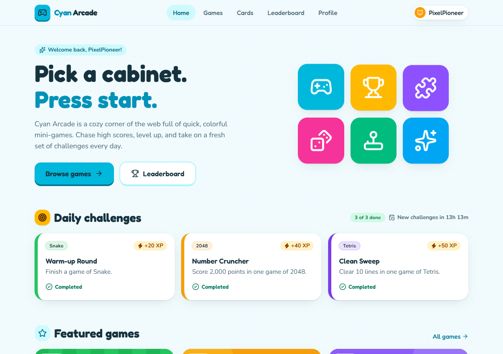

| | |
| --- | --- |
| 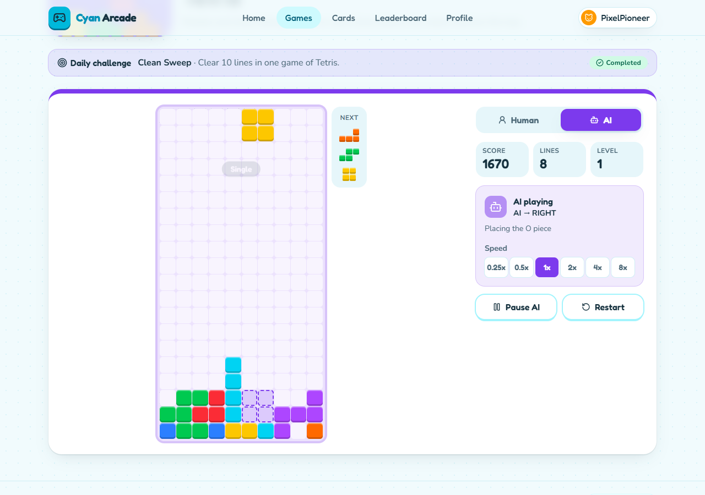 | 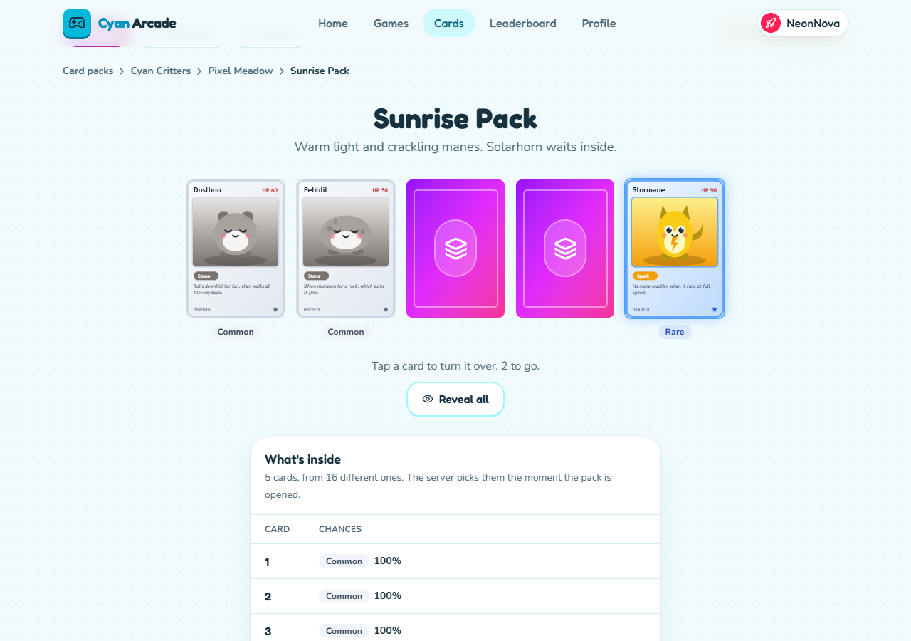 |
| Every game has an AI mode that plays by itself (for admins) | Packs of real cards, opened on the server and revealed one card at a time |
| 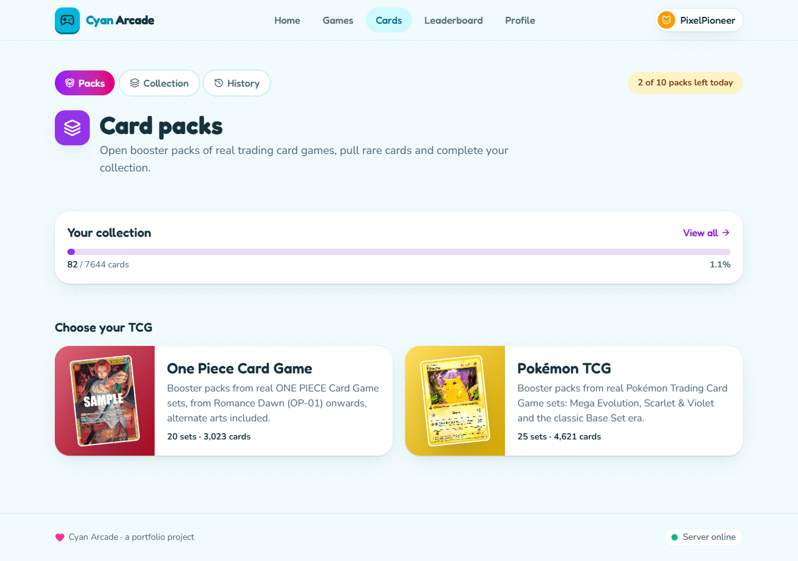 | 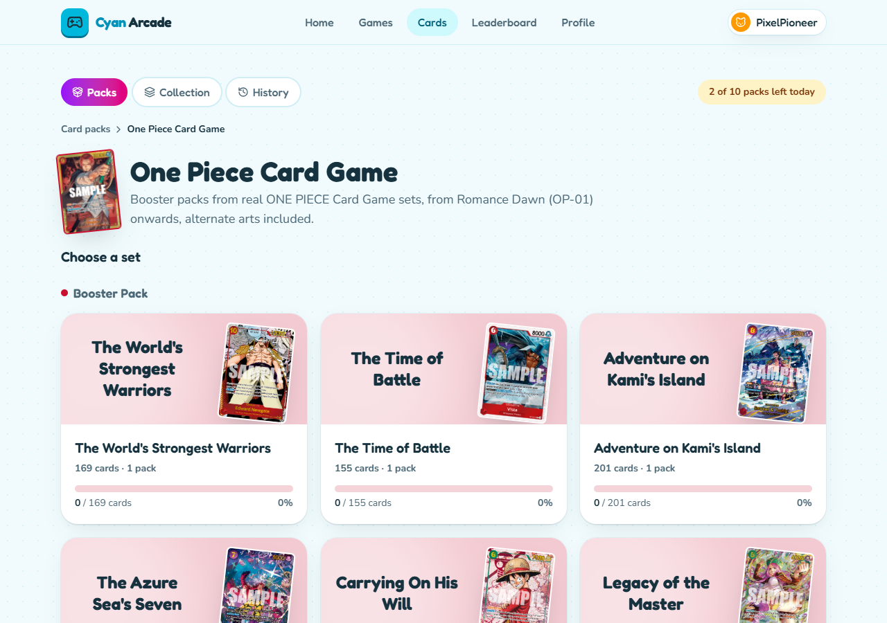 |
| Pokémon and One Piece, each in its own color | Real sets, shown by their logo or one of their rarest cards |
| 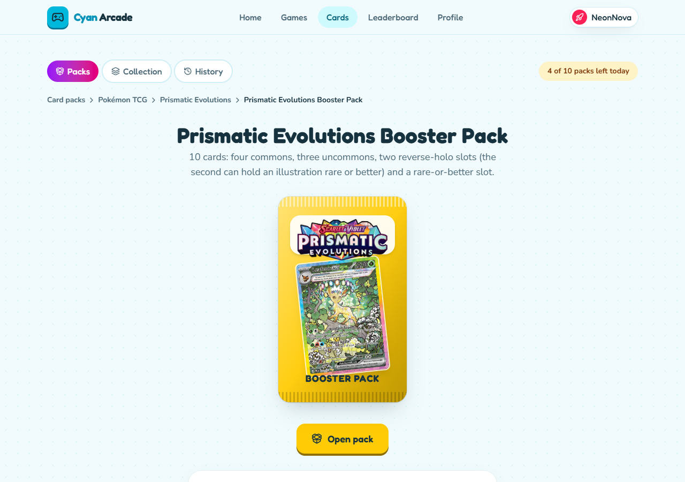 | 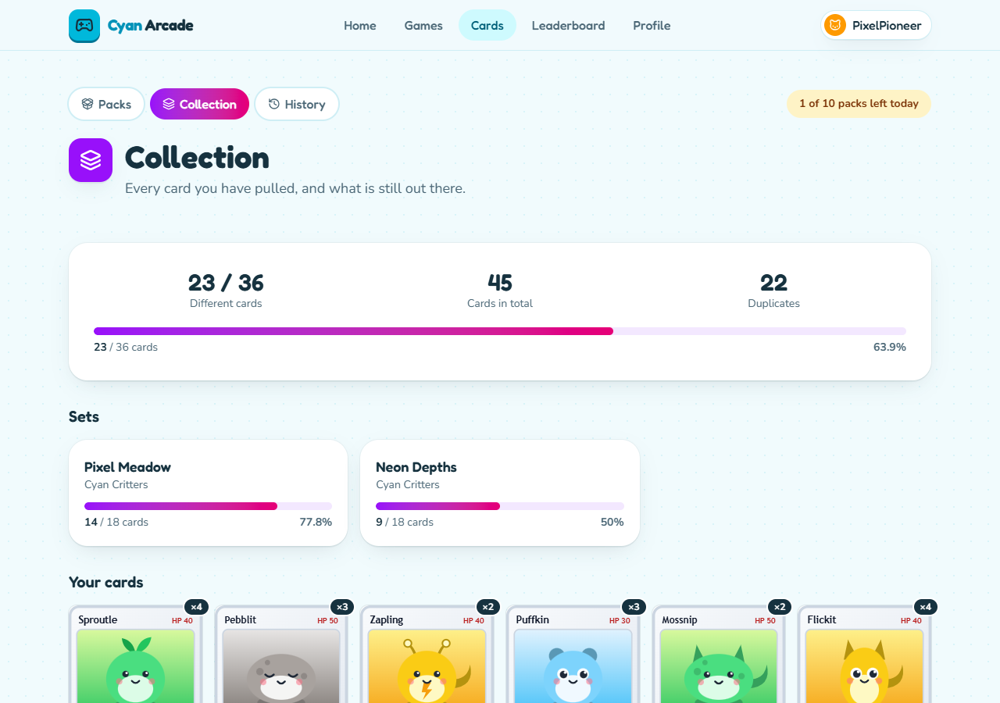 |
| Every pack publishes its odds, and says they are a simulator's | The collection, by game and set |
| 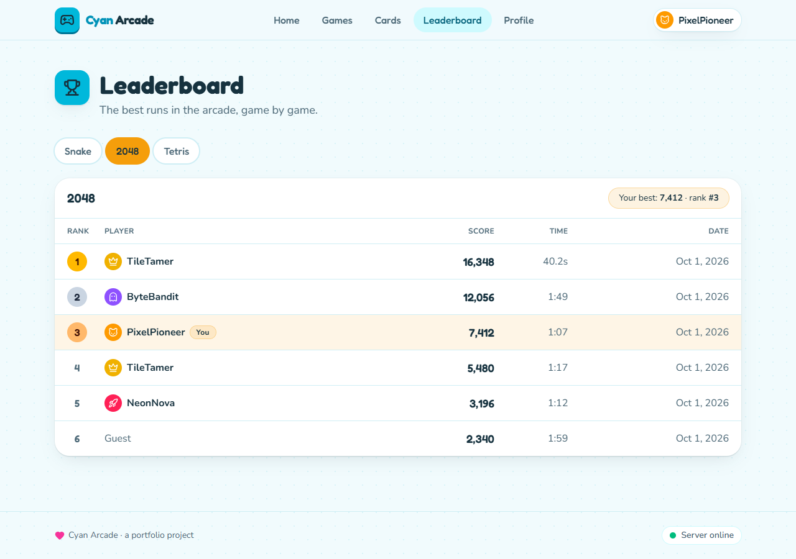 | 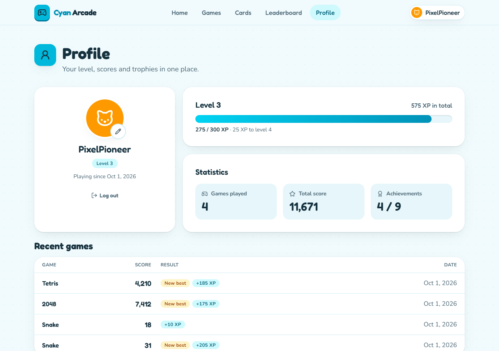 |
| Leaderboards with names, avatars and your own rank | Level, statistics, history and achievements |
| 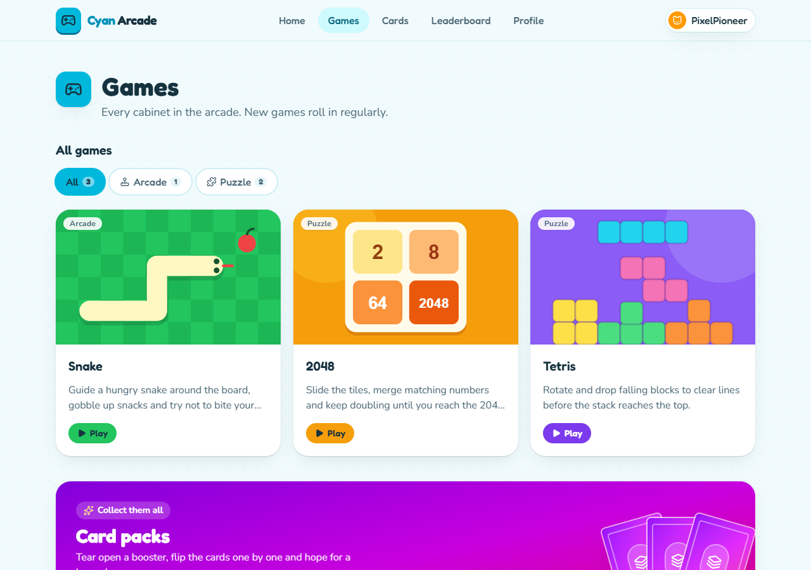 | |
| The catalog, filterable by category, and the way into card packs | |

<p>
  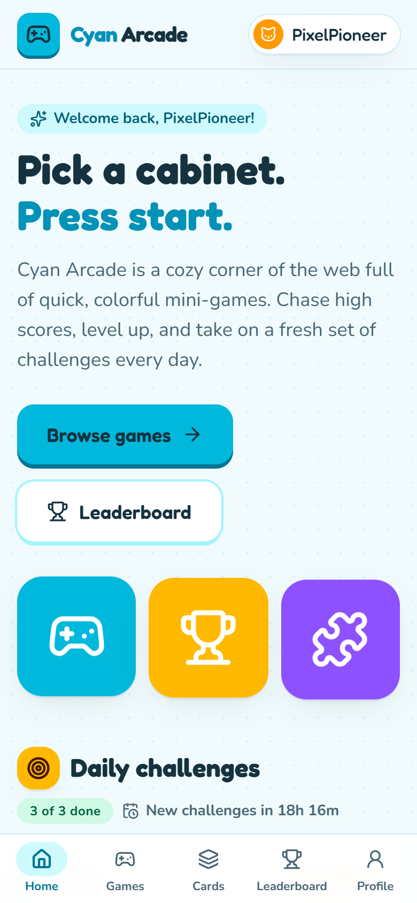
  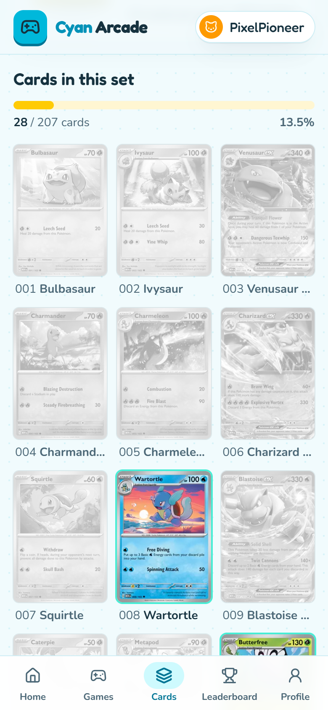
</p>

## Status

Everything listed below works end to end, in Docker, with 431 backend and 594 frontend tests passing. Nothing is a mock-up. See the [roadmap](#roadmap) for what is next and what is deliberately left out.

## Features

**Games**
- **Snake, 2048, Tetris and Minesweeper**, playable with keyboard and touch. Minesweeper (9 × 9, 10 mines, a safe first click, a Reveal/Flag switch for phones) is the reference for [adding a game](ARCHITECTURE.md#how-to-add-a-new-game): a module of its own and one rules class on the server, and the leaderboards, rewards, achievements, challenges and statistics work for it unchanged.
- **Flappy Bird**, an original take with a seeded course that speeds up and narrows over seven levels, frame-rate-independent physics, a canvas renderer, an admin-only look-ahead AI, and 16 birds, 11 obstacle themes and 5 skies sold in the shop. Skins are visual only: every bird flies with the same physics.
- **Brick Breaker**, built for game feel: a cute pixel-art anime arcade of eight handcrafted levels, each in its own world (Cute Sakura, Kawaii Candy, Anime Café, Magical Galaxy, Kitsune Shrine, Cyber Anime, Fantasy Dragon, Dark Moon), then a seeded Endless mode in a retro arcade with hard caps, combos up to ×2.5, nine power-ups (extra balls, Multi-Ball, x2 Score, Wide, Fireball, Laser, Magnet, Extra Life) dropping from about a fifth of the bricks, level-clear bonuses and Perfect Clears, particles, score pop-ups and screen shake, an admin-only AI that predicts bounces and aims at bricks, and paddles, balls and brick themes in the shop (admins may wear every Brick Breaker skin without buying it).
- **An AI mode for each, for admins**, written as classic algorithms that run in the browser (no AI service): a Hamiltonian-cycle Snake that fills the board, an expectimax 2048 player, and a Tetris player that searches every placement with one piece of lookahead. Speed control (0.25x to 8x), pause and restart.
- Pure, deterministic game engines shared by the human player, the AI and the tests.

**Platform**
- **Server-validated scores**: every human run is a server-side game session, and its score is checked and stored in PostgreSQL.
- **Leaderboards** per game for **today, this week and all time** (UTC; weeks from Monday): each player once with their best score, a podium for the top three, your own rank and best score even off the page, deterministic ranks without ties, and your ranks in every game on your profile.
- **Accounts**: register, log in, log out. Passwords are stored only as bcrypt hashes; the session lives in an `HttpOnly` cookie with CSRF protection; repeated failed logins are throttled.
- **Progression**: XP for every finished game, levels, and ten achievements, each worth XP and coins.
- **Coins**: a platform-wide currency earned by playing, beating your best, achievements, daily challenges and the daily login reward, and spent in the shop. Every change is a row in an auditable ledger; the server decides every amount. See [Economy](#economy-coins-rewards-and-the-shop).
- **Daily login reward**: once a day (UTC), more for every day in a row, a free card pack on day 7.
- **Daily challenges**: a new challenge per game every day, plus one for card packs ("open 3 packs"), created by a scheduled job and worth XP and coins.
- **Shop**: extra card packs, badges, titles, profile frames and game skins for coins, by category; some unlock at higher levels. Every item shows whether it is locked, too dear, owned or equipped; the shop explains the day's free packs and the bought ones. Badges, titles and frames are equipped from the shop and shown on the public profile; a coin history explains every reward.
- **Player identity**: a stable username (the account) and a display name, bio and avatar the player edits; a **public profile** for every player (`/players/{username}`) with their worn title and badge, statistics, ranks and achievements, linked from the leaderboards.
- **Profile**: level and XP progress, coins, statistics across the platform (games, play time, cards, packs, coins earned) and per game, game history, coin history, achievements, the badge and title you wear, and an avatar.
- **Game hub**: the home page puts your coins, level and daily reward first, then today's challenges, recently played games, featured games, card packs, the top scores of each game, your latest achievements and categories.
- **Admin dashboard**: users, active users, games, packs, cards and coins in circulation (all time and today), and audited coin grants.
- **Two roles**: every account is a **USER** (a player) or an **ADMIN**. Admins also get AI mode and card packs without a daily allowance. The server enforces both; see [Roles](#roles-players-and-admins).
- Guests can play every game; an account is only needed to earn things.

**Card packs (TCG)**
- **Real card data**: the **Pokémon TCG** (25 sets, 4,621 cards, from TCGdex) and the **One Piece Card Game** (20 sets, 3,023 cards with alternate arts, from OPTCG API), with their real names, numbers, rarities and card images.
- A trading-card module of its own, built to carry **any number of card games**, each with its own rarities, sets and pack layouts. Nothing in the tables is specific to one game.
- An **import job** that reads each game's source once and stores it in PostgreSQL. It is repeatable and idempotent; the arcade never calls a source while players browse or open packs.
- **Packs are opened on the server**: it draws each card from the pack's pool by the pack's published odds, records the opening and adds the cards to the collection in one transaction. The client only says which pack. Odds are labelled as **simulator probabilities**, since neither publisher gives official pull rates.
- A pack-opening experience: the pack tears open, cards are dealt face down and flipped one by one, rarer cards glow and burst, then a summary of new cards and duplicates. Each game has its own accent color; the arcade stays cyan.
- **Collection** by game and set, with completion, and an **opening history**. A daily pack allowance for players (10 by default), plus any extra packs bought in the shop; none for admins.

**Engineering**
- A modular monolith whose boundaries are enforced by tests (ArchUnit in the backend, source-level rules in the frontend).
- One error format for the whole API (RFC 9457 problem details), including 401/403 from the security layer.
- Accessible, responsive UI: phones, tablets and desktop; keyboard support; reduced-motion support; text colors checked against WCAG AA.
- Docker Compose stack with nginx serving the app with security headers and proxying the API.

## Architecture

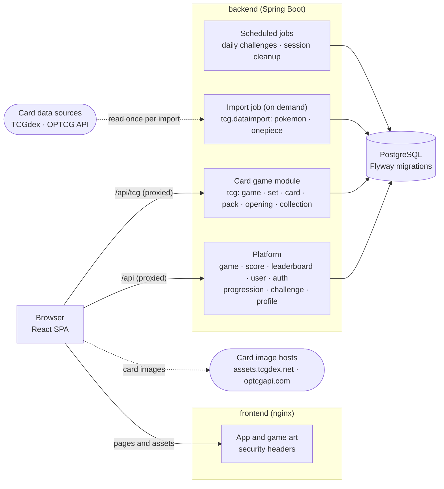

- **Frontend**: a React SPA. Each game is a module behind one small interface (`GameModule`), with its rules in a pure engine that knows nothing of React. The card game is a separate module mounted under `/tcg` and loaded on demand.
- **Backend**: one deployable Spring Boot application, packaged by feature. Features talk to each other through services and DTOs, never through each other's entities, and the card game module is invisible to the rest of the platform.
- **Card data**: imported from external sources into PostgreSQL by a job you run (see [Card games](#card-games)); pack opening, browsing and collections only ever read the database. Card images are loaded by the browser straight from the sources' image hosts.
- **Data**: PostgreSQL, with the schema owned by Flyway migrations and Hibernate set to `validate`.

The full design, including **how to add a new game**, is in [ARCHITECTURE.md](ARCHITECTURE.md). The API is documented in [API.md](API.md).

## Tech stack

| Layer    | Tech |
| -------- | ---- |
| Frontend | React 19, TypeScript, Vite, React Router, TanStack Query, Tailwind CSS 4, Lucide icons |
| Backend  | Java 21, Spring Boot 4 (Web MVC, Security, Data JPA, Validation, Actuator), Hibernate, Flyway |
| Database | PostgreSQL 18 |
| Testing  | Vitest + Testing Library, JUnit 5, MockMvc, Testcontainers, ArchUnit; coverage with V8 and JaCoCo |
| Tooling  | Docker Compose, nginx, Maven Wrapper, oxlint |

## Getting started

### Prerequisites

- **Docker** (Docker Desktop on Windows and macOS). Needed for the stack and for the backend's integration tests.
- For native development: **Java 21** and **Node.js 22+**. Maven is not needed; the repository ships the Maven Wrapper.

### Run everything in Docker

```bash
docker compose up --build
```

Open http://localhost:3000. The first start creates the database, runs the migrations and creates today's daily challenges. The card games are imported once, by a separate run that downloads them and exits (about a minute):

```bash
docker compose run --rm backend --spring.profiles.active=import-tcg
```

`docker-compose.yml` runs three services:

| Service | What it is | Reachable at |
| ------- | ---------- | ------------ |
| `frontend` | nginx serving the built app and proxying `/api` to the backend | http://localhost:3000 |
| `backend` | the Spring Boot API | http://127.0.0.1:8080 (this machine only, for tools) |
| `postgres` | PostgreSQL 18, data in the `db-data` volume | 127.0.0.1:5433 (this machine only) |

### Demo data

A fresh database has the games (and, once imported, the card games) but no players. To fill it the way the screenshots show:

```bash
node tools/demo/seed-demo-data.mjs
```

It plays through the public API: five demo players, games on every leaderboard, and some opened Pokémon and One Piece packs (import the card games first). It takes about two minutes, because the server measures how long each game lasted; `--packs-only` just opens packs for players who exist already. The demo accounts' password is in the script; it is for local demos only. `node tools/demo/capture-screenshots.mjs` then retakes the screenshots with a headless Chrome.

### Native development (hot reload)

```bash
docker compose up -d postgres                  # PostgreSQL on localhost:5433
cd backend && ./mvnw spring-boot:run           # API on http://localhost:8080 (Windows: mvnw.cmd)
cd frontend && npm install && npm run dev      # app on http://localhost:5173
```

Import or update the card games against the same database (once, and again whenever you want newer data):

```bash
cd backend && ./mvnw spring-boot:run -Dspring-boot.run.profiles=import-tcg
```

Vite proxies `/api` and `/actuator` to the backend, so the browser talks to one origin, as it does through nginx in Docker.

> `backend/src/test/java/com/cyan/arcade/TestCyanArcadeApplication.java` starts the backend against a throwaway Testcontainers database, without Compose.

### Database

- The schema is created and upgraded by **Flyway** when the backend starts (`backend/src/main/resources/db/migration`, `V1` to `V17`). There is no manual step.
- The **admin account** is created at the first start (see [Roles](#roles-players-and-admins)).
- The game catalog comes from migrations; the card catalog comes from the card game import (see [Card games](#card-games)).
- To start over with an empty database: `docker compose down -v`, then `docker compose up -d`.
- Login sessions are kept in the backend's memory, so restarting the backend signs everyone out. Everything else is in PostgreSQL.

### Configuration

Compose reads these from a `.env` file next to `docker-compose.yml`; [.env.example](.env.example) lists them with their defaults.

| Variable | Default | Meaning |
| -------- | ------- | ------- |
| `DB_NAME`, `DB_USERNAME`, `DB_PASSWORD` | `cyan_arcade`, `cyan`, `cyan` | The database and its credentials |
| `DB_PORT` | `5433` | Host port of PostgreSQL (5433 so it can run next to a local PostgreSQL) |
| `BACKEND_PORT` | `8080` | Host port of the API, bound to 127.0.0.1 |
| `FRONTEND_PORT` | `3000` | Host port of the app |
| `SESSION_COOKIE_SECURE` | `false` | Set to `true` wherever the site is served over HTTPS |
| `CORS_ALLOWED_ORIGINS` | `http://localhost:5173` | Origins allowed to call the API directly from a browser, comma-separated |
| `TCG_DAILY_PACK_LIMIT` | `10` | Card packs a player may open per day (UTC); `0` means no limit. Admins have none |
| `ADMIN_USERNAME`, `ADMIN_PASSWORD` | `admin`, `11112002` | The admin account created at first start. **Development defaults: change them** for anything reachable by others |

The backend reads further settings from environment variables when run natively (or when added to the `backend` service in Compose):

| Variable | Default | Meaning |
| -------- | ------- | ------- |
| `DB_URL` | `jdbc:postgresql://localhost:5433/cyan_arcade` | JDBC URL of the database |
| `SERVER_PORT` | `8080` | Port the API listens on |
| `LOGIN_MAX_FAILURES`, `LOGIN_FAILURE_WINDOW` | `5`, `5m` | Failed logins allowed per username and address, and how long they are remembered |
| `GAME_SESSIONS_ABANDONED_AFTER` | `24h` | How long a started game may stay unfinished before the hourly cleanup removes it |
| `SCHEDULING_ENABLED` | `true` | Switches every scheduled job on or off |
| `ADMIN_SEED_ENABLED` | `true` | Creates the admin account at startup when it does not exist |
| `DAILY_CHALLENGES_GENERATION_ENABLED` | `true` | Creates each day's challenges at startup and at midnight UTC |
| `REWARDS_GAME_COMPLETED_COINS`, `REWARDS_PERSONAL_BEST_COINS` | `5`, `15` | Coins for finishing a game, and extra for beating your own best |
| `REWARDS_GAMES_PER_DAY` | `40` | How many games a day (UTC) pay the coins for finishing; later ones still earn XP and best-score coins |
| `REWARDS_PERSONAL_BESTS_PER_DAY` | `10` | How many new personal bests a day (UTC) pay the best-score coins; later ones still earn their XP |
| `DAILY_LOGIN_REWARDS` | `50,60,70,80,100,125,200` | Coins for each day in a row of the daily login reward; then it starts over |
| `DAILY_LOGIN_BONUS_ITEM` | `EXTRA_PACK` | The shop item given on top on the last day (empty for none) |
| `TCG_IMPORT_SOURCES` | empty (`pokemon,one-piece` in the `import-tcg` profile) | Card game sources to import at startup. An ordinary start imports nothing |
| `TCG_IMPORT_FILES` | empty | Comma-separated paths of card game datasets (the arcade's own JSON format) to import at startup |
| `TCG_POKEMON_URL`, `TCG_POKEMON_CONFIG` | TCGdex's GraphQL API, `classpath:tcg/sources/pokemon.json` | Where Pokémon data comes from, and which sets and pack layouts to use |
| `TCG_ONE_PIECE_URL`, `TCG_ONE_PIECE_CONFIG` | `https://optcgapi.com/api`, `classpath:tcg/sources/one-piece.json` | The same for One Piece |

Frontend build and dev settings:

| Variable | Default | Used by |
| -------- | ------- | ------- |
| `API_PROXY_TARGET` | `http://localhost:8080` | The Vite dev server's proxy |
| `VITE_API_BASE_URL` | empty (same origin) | Browser code, to call the backend directly instead of through a proxy |

## Roles: players and admins

Every account has exactly one role. Signing up always makes a **USER**; the only **ADMIN** is the account the application creates for itself.

| | USER (player) | ADMIN |
| --- | --- | --- |
| Play the games, scores, leaderboards, XP, achievements, daily challenges | ✅ | ✅ |
| Collect cards, opening history | ✅ | ✅ |
| Card packs | 10 a day (`TCG_DAILY_PACK_LIMIT`) | **No daily limit** |
| **AI mode** (Snake, 2048, Tetris play themselves) | ❌ | ✅ |
| Admin page (`/admin`) | ❌ | ✅ |

**Development admin account**

| Username | Password |
| --- | --- |
| `admin` | `11112002` |

These are **demo and development credentials only**. Set `ADMIN_USERNAME` and `ADMIN_PASSWORD` (in `.env` for Docker, or as environment variables) before the arcade is reachable by anyone else, or set `ADMIN_SEED_ENABLED=false` and create no admin at all.

- **Seeding**: at startup, if no account has the admin username, one is created with the ADMIN role and the password hashed by the same bcrypt encoder as every other password. Otherwise nothing happens: restarting creates no duplicate, never resets the password, and never promotes a player who registered that name first (it logs a warning instead). The password is never logged. Changing `ADMIN_PASSWORD` later does not change an account that already exists.
- **How it is enforced**: the role is stored with the account (`users.role`) and becomes the session's Spring Security authority, `ROLE_USER` or `ROLE_ADMIN`, when the player signs in. Admin-only endpoints (`/api/admin/**`, `/api/ai/**`) require `ROLE_ADMIN` in the security configuration and again with `@PreAuthorize("hasRole('ADMIN')")` on their controllers; a player gets `403`, a guest `401`. Nothing checks a username.
- **AI mode**: the games' AIs run in the browser, so what is protected is the AI itself. The app loads a game's AI only after `GET /api/ai/access` succeeds, and the AI's code is built into separate files (`/assets/ai/`) that nginx serves only when that same check passes for the request's session. A player sees no AI switch and cannot download the AI by its address either. (The Vite dev server does not have that last check.)
- **Packs**: the daily allowance is checked in one place, the pack opening itself, which skips it for ROLE_ADMIN. Admins open packs through exactly the same code otherwise, so collections and histories work the same.
- **The UI follows the role** (an Admin button in the header, the AI switch, "Unlimited packs · Admin"), but only as a convenience: the server decides.
- A role is read when the player signs in, so a role change takes effect at their next sign-in.

## Economy: coins, rewards and the shop

Coins are the platform's currency. Players earn them by playing and spend them in the shop; nothing about them is real money.

| Earned by | Coins | Paid once per |
| --- | --- | --- |
| Finishing a game | 5 (the first 40 games of a day) | game session |
| Beating your own best in a game | 15 | game session |
| Unlocking an achievement | 100 to 500 (set per achievement) | achievement |
| Completing a daily challenge | 40 to 120 (set per challenge) | challenge |
| Daily login reward | 50, 60, 70, 80, 100, 125, 200 (+ a free pack) | day |
| An admin's grant | 1 to 100,000, with a reason | request |

- **The server decides every amount.** No request ever says how many coins to add; the client says what happened (a game finished, today's reward claimed, this item bought) and the server applies its own rules.
- **A ledger, not just a number.** Every change is a row in `coin_transactions` (amount, balance after, type, what it refers to, description, and for grants the admin who made them). The balance in `user_wallets` is kept next to it for quick reads and is always the sum of the ledger.
- **Nothing is paid twice.** Each reward refers to what it rewards (the game session, the achievement, the challenge, the day), and a unique index allows one transaction per player, type and reference: a repeated or replayed request finds the first and pays nothing.
- **Nothing goes below zero.** Every change locks the player's wallet row first, so changes to one balance happen one at a time; spending more than the balance fails and changes nothing, and the database refuses a negative balance anyway.
- **All or nothing.** A reward is paid in the same transaction as what earned it (the score, the claim, the challenge); if anything fails, all of it is rolled back.
- **The day is the server's, in UTC**, for the daily login reward as for challenges and the pack allowance. The client's date is never asked for.

**The shop** sells extra card packs (consumable: opened once the daily allowance is gone, from any booster, and bought as often as you like) and badges, titles and profile frames (owned once and equipped on the profile, one of each, visible on the public profile). Some items need a level (the level system's unlocks). A purchase names the item and a random request id: the server checks the level, what you already own and your balance, takes the price and hands the item over in one transaction, and the same request id never buys twice. What an item does is decided by a handler for its type (`PACK`, `BADGE`, `TITLE`, `COSMETIC`, `GAME_SKIN`), so a new kind of item is a new handler, not a change to the shop. Game skins belong to a game and a slot (Flappy Bird's `bird`, `pipes` and `sky`; Brick Breaker's `paddle`, `ball` and `bricks`): one is worn per slot, wearing none means the game's own free look, and the game draws them itself, in the game and in the shop.

**Admins** keep their unlimited card packs and never use bought ones. They can give a player coins from the admin page: between 1 and 100,000, with a reason, recorded in the player's ledger as an `ADMIN_GRANT` with who gave them.

## Card games

The arcade carries two real trading card games. Their data is **imported** into PostgreSQL from public sources; at runtime the arcade only reads its own database.

```text
External source ──(import job, on demand)──▶ PostgreSQL ──▶ Cyan Arcade (browsing, packs, collections)
```

| Game | Source | What is imported | Images |
| ---- | ------ | ---------------- | ------ |
| Pokémon TCG | [TCGdex](https://tcgdex.dev) GraphQL API: open source, free, no key | 25 sets (Mega Evolution, Scarlet & Violet, Base Set, Jungle, Fossil), 4,621 cards with rarities, set logos and release dates | `assets.tcgdex.net`, in two sizes: small for grids, large for a closer look and pack openings |
| One Piece Card Game | [OPTCG API](https://optcgapi.com): a free, fan-run public API for the English game | 20 sets (OP-01 to OP-17, the OP14/OP15 boosters with EB04, EB-01 to EB-03), 3,023 cards including parallels, manga, SP and treasure rares | `optcgapi.com`, one size |

- **Run it** with the `import-tcg` profile (commands above); `TCG_IMPORT_SOURCES=pokemon` imports one game. A run takes about a minute and a few dozen requests: one or two per set.
- **Repeatable and idempotent**: every card is keyed by its source's id (`sv01-001`, `OP01-120_p1`), so running it again adds what is new, updates what changed and duplicates nothing. Nothing is deleted, because collections and opening histories point at cards.
- **Configurable**: which sets to take, what each source rarity is called and how rare it is, and how each kind of pack is made up live in `backend/src/main/resources/tcg/sources/*.json`, not in code.
- **Pack odds are simulator probabilities.** Neither The Pokémon Company nor Bandai publishes official pull rates, so each pack layout is this arcade's approximation, and every pack says so on its page.
- **Adding another card game** means one new source (a client and a mapper to the generic dataset format) and a configuration file; the tables, the API and the pages stay as they are. A game with no API can also be imported from a dataset file (`TCG_IMPORT_FILES`).

**Licensing and usage.** Card names, text and images are © their publishers (Nintendo, Creatures, GAME FREAK and The Pokémon Company; Eiichiro Oda/Shueisha, Toei Animation and Bandai). TCGdex and OPTCG API are community projects, not official sources. Cyan Arcade is a non-commercial fan and portfolio project, not affiliated with or endorsed by any of them, and says so on every card game page. Card images are not copied into this repository; the browser loads them from the sources' hosts, so they appear only while those hosts serve them.

**Data limitations.** TCGdex does not tell holo rares from other rares in the classic sets. OPTCG API marks alternate arts in the card name ("(Parallel)", "(Manga)"), which the import turns into rarities; a few alternate arts it lists under the base card's id get a derived id (`OP14-074-dash-pack`). One Piece images are the official preview images, with a "SAMPLE" mark. Release dates are known for Pokémon sets only.

## Testing

```bash
cd backend && ./mvnw verify      # all backend tests, then a coverage report (Docker must be running)

cd frontend
npm run typecheck
npm run lint
npm test
npm run coverage                 # the tests again, with a coverage report
npm run build
```

| | Tests | Line coverage | Branch coverage | Report |
| --- | --- | --- | --- | --- |
| Backend | 431 | 97.6 % | 87.1 % | `backend/target/site/jacoco/index.html` |
| Frontend | 594 | 97.2 % | 90.9 % | `frontend/coverage/index.html` |

- **Backend** integration tests run against a real PostgreSQL in Testcontainers, never an in-memory substitute, and go through HTTP with MockMvc. They cover registration, authentication and login throttling, score submission (including simultaneous finishes), leaderboards, achievements and XP, daily challenges, the coin ledger (simultaneous spending, rewards paid once, rollbacks), the daily login reward over several days and under simultaneous claims, the shop (replayed and simultaneous purchases), admin grants, and card packs: the odds over 100,000 simulated packs, duplicates, the daily limit under concurrent requests, and a failure halfway through an opening that must leave nothing behind. The card game sources are tested on recorded answers of the real APIs (no network): mapping, retries, idempotent re-imports, alternate arts and reprints.
- **Frontend** tests cover the game engines and AIs, the input hooks, every page through the real route table against an in-memory fake of the API, and architecture rules (engines import nothing from React or the browser, games do not reach into each other, the card game is used only through its routes).

## Project layout

```text
.
├── docker-compose.yml        # postgres + backend + frontend
├── .env.example              # settings for docker compose
├── backend/                  # Spring Boot modular monolith, packaged by feature
│   └── src/main/
│       ├── java/com/cyan/arcade/
│       │   ├── common/       # errors, security, time, scheduling
│       │   ├── game/  score/  leaderboard/          # catalog, score submission, rankings
│       │   ├── user/  auth/  profile/               # accounts, sign-in, the player's own data
│       │   ├── progression/  challenge/             # XP, levels, achievements, daily challenges
│       │   ├── economy/  dailylogin/  shop/          # coins and their ledger, the daily login reward, the shop
│       │   ├── admin/        # admin dashboard, coin grants, AI access
│       │   └── tcg/          # the card game module: game, set, card, pack, opening, collection, dataimport
│       └── resources/
│           ├── db/migration/     # Flyway migrations V1 to V17
│           └── tcg/sources/      # which sets to import, rarities and pack layouts, per card game
├── frontend/                 # React + Vite SPA, served by nginx in Docker
│   ├── nginx/                # nginx configuration and security headers
│   ├── public/               # favicon and game thumbnails
│   └── src/
│       ├── app/  api/  components/  hooks/  layouts/  pages/  lib/  styles/
│       ├── games/            # shared/ plus snake/, 2048/, tetris/: engine, ai, hooks, components
│       └── tcg/              # the card game module: api, pages, pack opening, components
├── tools/
│   └── demo/                 # demo data and screenshots
└── docs/screenshots/
```

## Roadmap

1. ✅ **Foundation**: project setup, design system, pages, game catalog, Docker
2. ✅ **Snake, 2048, Tetris**: engines, Human mode and AI mode
3. ✅ **Score keeping** and **leaderboards**
4. ✅ **Accounts**: registration, login, profile, named leaderboard entries
5. ✅ **Progression**: XP, levels, achievements, game history
6. ✅ **Daily challenges and the game hub**
7. ✅ **Card packs (TCG)**: card games, sets, packs, server-side opening, collection, history, dataset import
8. ✅ **Production polish**: audit, security hardening, accessibility, test coverage, Docker and nginx
9. ✅ **Real card data**: Pokémon (TCGdex) and One Piece (OPTCG API) imported into PostgreSQL, game-specific pack layouts, a TCG chooser
10. ✅ **Roles**: USER and ADMIN, a seeded admin account, AI mode and unlimited packs for admins, enforced by the server
11. ✅ **Platform economy**: coins and their ledger, rewards for playing, achievements and challenges, the daily login reward, card pack challenges, the shop with extra packs, badges and titles, statistics, the admin dashboard and coin grants
12. ✅ **Competitive leaderboards**: daily, weekly and all-time boards per game, one entry per player, deterministic ranks, your rank everywhere, a podium, ranks on the profile
13. ✅ **Player identity**: display names, bios, public profiles, display names on leaderboards
14. ✅ **Shop and rewards**: shop categories, item states (locked, owned, equipped, affordable), profile frames, pack rules in the shop, a grouped inventory, the reward history and clearer daily rewards
15. ✅ **Score integrity**: each game's runs checked against its engine's rules and the server's clock, guest runs tied to their browser, expired sessions, players' runs judged one at a time, a daily limit on best-score coins. Practical protection, not perfect anti-cheat
16. ✅ **New games**: a clean game boundary (game rules in their own backend package, guarded by architecture tests on both sides) and Minesweeper as its reference game
17. ✅ **Flappy Bird**: a seeded, deterministic course with server-side timing checks, an admin-only AI, and game skins (birds, obstacles, skies) through the ordinary shop and inventory
18. ✅ **Brick Breaker**: a deterministic arcade engine with power-ups, combos and levels, server-side run checks against the levels' brick counts, an admin-only AI, and paddle, ball and brick skins
19. **Next**: deployment to a host with HTTPS, login sessions that survive a restart (Spring Session), password reset, more games (Memory) and multiplayer (Chess, Connect Four)

Known limits, on purpose for now: no email or password reset; scores made as a guest are not moved to an account created later; scores and the numbers games report about a run are validated for range but not replayed, so they are not cheat-proof; login throttling is kept in memory per backend instance; card images depend on the sources' image hosts being up; the admin account is fixed by configuration (there is no page to manage roles); coins can be farmed only as fast as scores can, since scores are not replayed (finishing a game pays coins for the first 40 games a day only).
